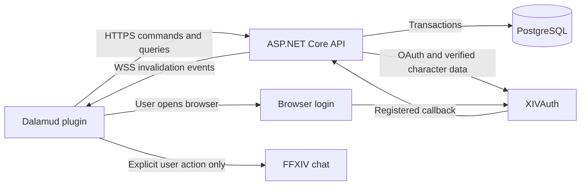

# Architecture

## Proposed baseline

Single repository, one ASP.NET Core API deployment, PostgreSQL, and a separately
distributed Dalamud plugin. XIVAuth supplies identity. Render is the initial hosting
candidate. These are proposed implementation choices, not deployed infrastructure.

Start with a modular monolith: feature folders inside one server. A domain/use-case
project owns invariants; a contracts project owns transport DTOs. No microservices,
message broker, generic workflow engine, or Redis dependency in 1.0.

## Boundaries

| Boundary | Responsibilities | Must not contain |
| --- | --- | --- |
| Plugin | UI, local settings/drafts, networking, character context, chat adapter | Authoritative balances/permissions or provider secrets |
| Contracts | Versioned requests, responses, stable IDs/error/event types | EF entities, Dalamud APIs, provider implementation |
| Core | Group rules, quotas, inventory behavior, trade transitions, use cases | ImGui, HTTP-specific handling, game memory access |
| Server | Endpoint authorization, validation, EF/Npgsql persistence, XIVAuth adapter, hosting | Business rules duplicated in controllers |

Dependency direction: Plugin -> Contracts; Server -> Core + Contracts; Core has
no dependency on Plugin, Server, or Contracts. Map domain values to DTOs at the
server boundary. Feature handlers keep transactions close to the rules they enforce.

## Authority and consistency

PostgreSQL is the source of truth. A successful command commits inventory, quota,
currency ledger, history, reservations, operation identity, and change-event rows
together. Emit notifications only after commit. Server restart may lose connections
but never committed trades or reservations. Query results recover missed events.

Use concurrency tokens for resource updates; group/character policy locks and
deterministic resource-lock ordering for trade and quota commands. Multi-resource
checks cannot be implemented as independent read/update requests. Database
constraints backstop application checks. Do not claim exactly-once network delivery;
provide durable deduplicated operations and outcome recovery instead.

One server instance is sufficient for the initial target. Keep persistent state
out of instance memory; database-backed event rows permit future fan-out. Auth
attempts, sessions, expiry and idempotency live in shared storage. A background task
may clean expired records/reservations, but commands must independently enforce
expiry and stale reservations even when that task has not run.

## Configuration and extension points

| Setting | Owner/configuration source |
| --- | --- |
| Active backend URL | Plugin setting; trusted HTTPS default plus deliberate custom endpoint selection |
| Database/provider credentials, callback URLs, keys | Server secret/environment configuration |
| Owned/joined group maxima (3/6) | Validated server policy, advertised by capabilities endpoint |
| Default letters/week (5), initial potion points (0) | Server defaults copied into group policies |
| Current/next weekly allowances | Versioned owner policy in database |
| Potion cost/content/category | Owner-defined immutable revision |
| Type IDs and supported behavior | Explicit code registry and contracts |
| Message/text/request/inventory ceilings | Named validated server options; advertised where relevant |
| Reset weekday/time (Monday 00:00 UTC baseline) | Service policy; changing requires controlled period migration |
| Trade/session/event/idempotency expiry | Named server options, documented defaults |
| Icons, UI labels, localization | Bundled asset/label catalog; no arbitrary script loading |

Configurable does not mean arbitrary: group owner limits cannot exceed service
ceilings, type behavior is tested code, and clients must handle unsupported types
with a read-only fallback. Protocol enums for fixed state machines are appropriate;
item types/capability identifiers should be extensible strings. Do not store enum
ordinal values in the database or scatter potion/letter conditionals across UI code.

Implement a small `IItemTypeHandler` registry (validate/create/use/trade eligibility
and details schema) and plugin details renderer registry. Keep creation mechanics
type-specific; no generalized crafting system is needed. Parameterized categories
and immutable revisions provide expansion without executable user content.

HTTP commands remain canonical; WSS events notify views to refresh. Events do not
grant authority, complete trades locally, or send chat. See [API](api.md).

## Compatibility

Version API as `/api/v1`; negotiate minimum client/protocol and supported types in
capabilities. Add optional fields compatibly; use new API version for breaking
changes. Unsupported client commands fail with explicit update guidance. Store
`typeDataVersion` in snapshots. Migrate data using version-controlled migrations;
retain old readers where existing holdings require them. See the dated
[version matrix](versions.md) for platform/dependency targets and maintenance gates.
Exact resolved pins belong in project/tool manifests and release records after
the build spike, not scattered through feature code.
